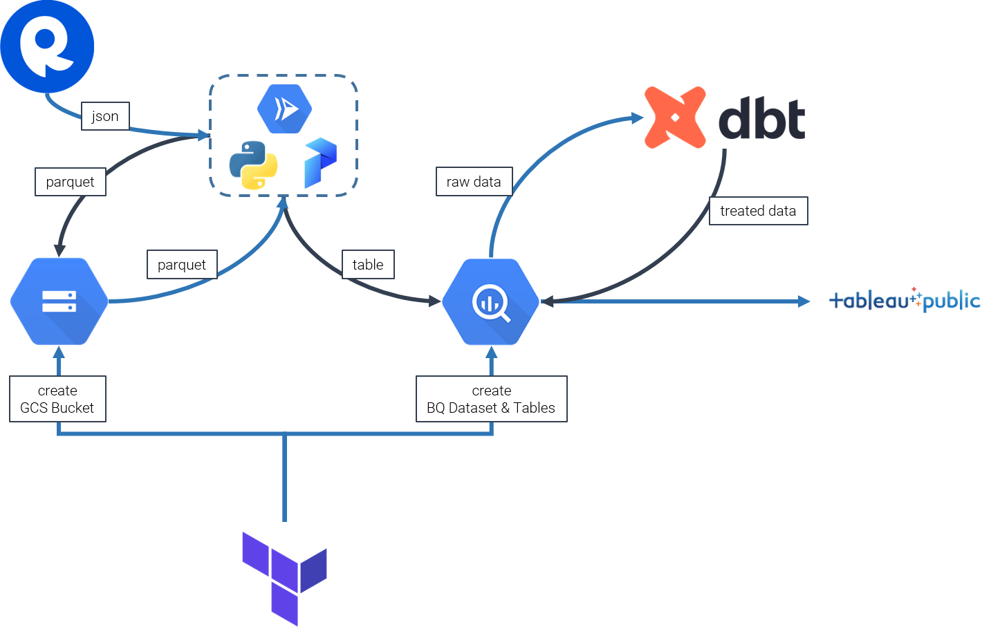
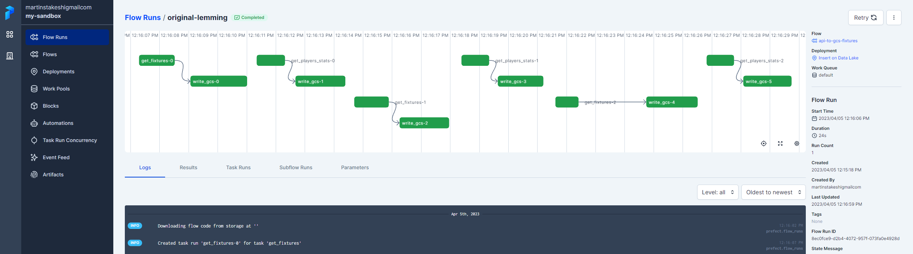
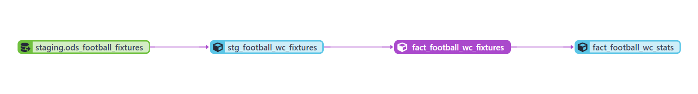
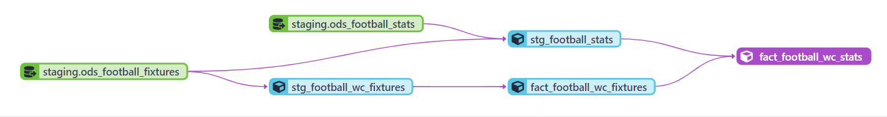

# 1. Project Description


The goal of this Data Engineering Zoomcamp Project is to apply everything we learned in this course and build an end-to-end data pipeline.

The files used are on my Github Account [Github](https://github.com/danietakeshi/de-zoomcamp-2023).

The project fetchs the data from a source and creates a pipeline to a Datalake, after that a pipeline leads to a Datawarehouse where the data is transformed from raw data to dashboard ready tables.

Data will be fetched from 2 endpoints (*fixtures* and *players*) from [API-Football](https://rapidapi.com/api-sports/api/api-football/). The fixtures endpoint has the match results data and the players has each individual players statistics for a given match. On the data pipeline we will use only the World Cup match results.

Tools utilized:
1. Terraform: Infraestructure Management (DataLake [*Google Cloud Storage*], DataWarehouse [*Google Big Query*] and Tables);
2. Python + Prefect running on Cloud Run: ETL Processess (API consumption, save files on the DataLake  and load data into the DataWarehouse);
3. dbt: Transform data on DataWarehouse;
4. Tableau: Create and Visualize Dashboard;



# 2. Creating Infraestructure with Terraform

Terraform was used to create the infraestructure on GCP (Google Cloud Platform).

On *variables.tf* file the necessary variables are defined to create the given structure, incuding the prefix of the GCS (Google Cloud Storage) Bucket name, the region to be consider and the Dataset and tables names on BQ (Google Big Query).

On *main.tf* file the necessary commands to build the infraestructure are located, including the schemas from the fixtures and payers' stats tables.

For the fixtures table a partition was added on a day level for the column fixture_date and a cluster by league_name because the will be a filter for the World Cup matches.

For the statistics table a cluster on the fixture_id column was added to optimize the match filters.

Run the codes below on the Terraform directory to create the GCS Bucket, the Dataset and the tables on BQ:
```
# Refresh service-account's auth-token for this session
gcloud auth application-default login

# Initialize state file (.tfstate)
terraform init

# Check changes to new infra plan
terraform plan -var="project=<your-gcp-project-id>" 

# Create new infra
terraform apply -var="project=<your-gcp-project-id>"

# Delete infra after your work, to avoid costs on any running services
terraform destroy
```

Prerequisits:
- Terraform
- GCP Account
- GCloud CLI

# 3. Data Pipeline

The Data Pipeline was built in Python, using Prefect Cloud for orchestration and process management.

Prerequisits:
- Python
- GCP Account
- Docker
- Prefect Cloud with configured blocks:
    - GCS Bucket ('gcs-bucket')
    - GCS ('zoom-gcs')
    - GCP Credentials ('zoom-gcp-creds')
    - GCP Cloud Run Job ('cloud-run-zoomcamp')
    - Secret ('football-api-key')

Cloud Run Prefect Block was used to run the data pipeline on GCP inted of running localy. The article below was used as a reference:

['Serverless Prefect Flows with Google Cloud Run Jobs'](https://medium.com/the-prefect-blog/serverless-prefect-flows-with-google-cloud-run-jobs-23edbf371175)

There were made changes on the Dockerfile for our Pipeline to run on Google Cloud Run:
```Docker
FROM prefecthq/prefect:2.6.5-python3.10
RUN ["pip", "install", "gcsfs", "pandas", "requests", "prefect_gcp", "pyarrow", "fastparquet", "pandas-gbq"]
RUN mkdir ./parquet_files
```

Build imagens and push to Google Artifact Registry:
```docker
docker build -t us-central1-docker.pkg.dev/{project_id}/{art_reg_folder}/prefect-image:2.6.5-python3.10 .

docker push us-central1-docker.pkg.dev/{project_id}/{art_reg_folder}/prefect-image:2.6.5-python3.10
```

This Docker image will be used on the Prefect Cloud Run Block on the Image Name field.

Creating Deployments with Prefect:
```python
prefect deployment build -n "Insert on Data Lake" \
-sb gcs/zoom-gcs \
-ib cloud-run-job/cloud-run-zoomcamp \
football_api.py:api_to_gcs_fixtures -q default -a

prefect deployment build -n "Insert Fixtures on Data Warehouse" \
-sb gcs/zoom-gcs \
-ib cloud-run-job/cloud-run-zoomcamp \
etl_gcs_to_bq.py:etl_insert_fixtures -q default -a

prefect deployment build -n "Insert Stats on Data Warehouse" \
-sb gcs/zoom-gcs \
-ib cloud-run-job/cloud-run-zoomcamp \
etl_gcs_to_bq.py:etl_insert_stats -q default -a
```

After running the deployment build commands it will be possible to activate de Deployments on the Prefect UI or using the commands below:
```
prefect deployment run "api-to-gcs-fixtures/Insert on Data Lake"

prefect deployment run "etl-insert-fixtures/Insert Fixtures on Data Warehouse"

prefect deployment run "etl-insert-fixtures/Insert Stats on Data Warehouse"
```



The API-Football has a limitations of 100 calls on the free tier, so the Deployment "Insert on Data Lake" must be done when there are available calls. The file "world_cup_dates.parquet" contains the dates that the matches were played.

On the "etl_gcs_to_bq" redefine the variables:
- bq_dataset : Dataset name created on BQ
- bq_project_id : Project ID on GCP

# 4. Data Build Tool

Dbt scripts were created to transform the raw data fetched from the API, creating the fact tables ready for consumption on Tableau.

For the fixtures data a transformation was used on the fixture_venue_name_treated and the fixture_venue_city_treated columns because some city have null values.

Creation of a column with the Winning team's name and applied a filter for the World Cup Matches.

Creation of a macro to describe the results of a match from the column fixture_status_short;


For the statistics, on the stage environment we filtered the World Cup matches using the fixtures staging table.

Creation of a macro de detail the Players position on a match.

Made a join to get information from the fixtures table to the statistics table.


To run the models the commands below were used:
```
dbt build --select stg_football_wc_fixtures --var 'is_test_run: false'

dbt build --select stg_football_stats --var 'is_test_run: false'

dbt build --select fact_football_wc_fixtures

dbt build --select fact_football_wc_stats
```

On the "schema.yml" file on the staging directory, alter the schema to the name of the dataset configured on the Terraform file.


# 5. Dashboard no Tableau

For presenting the data the Tableau software was used, once it has a direct connection to the Big Query tables.


The Dashboard is published on the following link: https://public.tableau.com/app/profile/daniel.takeshi/viz/WorldCupInfo_16805323954260/WCInfo

The Dashboard can be filtered clicking on the elements of each Graphic and, clicking on the Top Scorers the Picture and the related data are refreshed.

#dezoomcamp #dataengineering #python #prefect #dbt #googlecloud #tableau #terraform #etl
